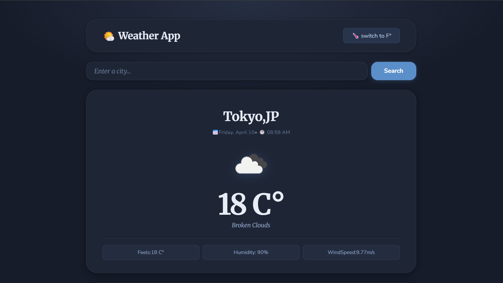

# 🌤️ Weather App

A responsive React weather app. Search any city, or use your current location, to see live conditions, the city's local time, and a 5-day forecast from the OpenWeather API.

**Live demo:** _add your Vercel link here_



## Features

- **Search by city** or tap 📍 to use your current location
- **Current conditions:** temperature, feels-like, today's high and low, humidity, wind, pressure, and visibility
- **Local time, sunrise, and sunset** shown in the searched city's own timezone
- **5-day forecast** with each day's real high and low, calculated from the 3-hour forecast data
- **°C / °F toggle**, with wind and visibility switching units too
- **Remembers** your last city and preferred unit
- **Clear error messages** for unknown cities, network problems, and denied location access
- **Fast and reliable:** weather and forecast load in parallel, and outdated requests are cancelled when you search again
- Responsive layout, keyboard focus styles, and reduced-motion support

## Tech stack

- React 19 (hooks: `useState`, `useEffect`)
- Vite
- CSS with custom properties
- [OpenWeather API](https://openweathermap.org/api) (current weather and 5-day / 3-hour forecast)

## Getting started

```bash
git clone https://github.com/rt0846092-hash/WeatherAppByDaddaa.git
cd WeatherAppByDaddaa
npm install
npm run dev
```

### API key

The app works out of the box with the included free-tier key. To use your own, get a key from [openweathermap.org](https://openweathermap.org/api) and create a `.env.local` file:

```env
VITE_OPENWEATHER_API_KEY=your_api_key_here
```

On Vercel, add the same variable under **Settings → Environment Variables**. Note that in any browser-only app the key is visible to visitors; hiding it completely would require a small backend or serverless function.

## Project structure

```
src/
├── App.jsx                     # Data fetching, forecast processing, state
└── components/
    ├── SearchForm.jsx          # City search and "use my location"
    ├── weatherData.jsx         # Current conditions card
    └── forecastData.jsx        # 5-day forecast
```

## Author

Roshan Tamang · [GitHub](https://github.com/rt0846092-hash) · [LinkedIn](https://www.linkedin.com/in/roshan-tamang-663015283)
